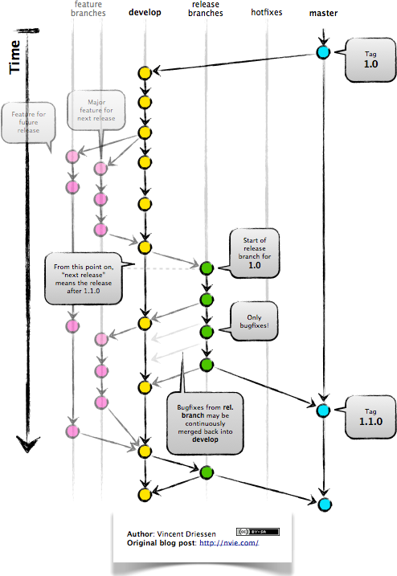

# Git-flow

We use git-flow across all our projects. Here is a diagram that showcases how a typical project branch structure would look.

Please read this article thoroughly to understand how git-flow works [https://datasift.github.io/gitflow/IntroducingGitFlow.html](https://datasift.github.io/gitflow/IntroducingGitFlow.html)

