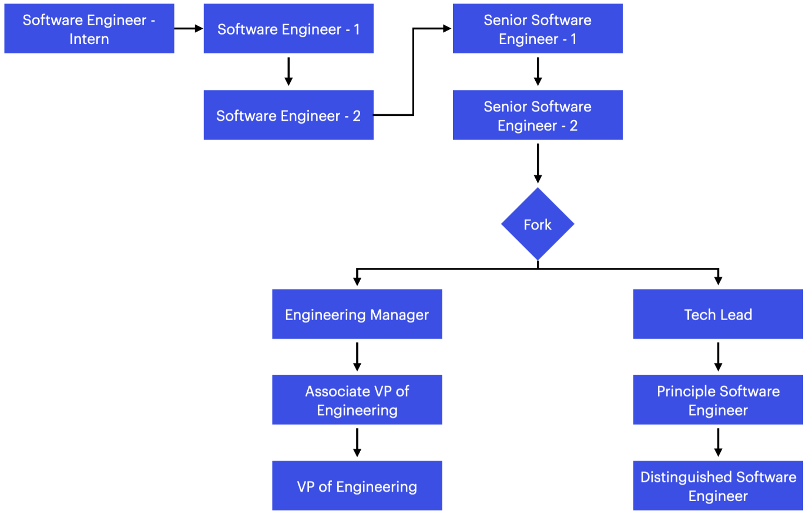

# Career Growth

Titles are external only. An environment where people have a "this is not a part of my job description" attitude is not what we like. Titles however allow our customers to understand your roles and responsibilities.

## Roles & Responsibilities

### Software Engineer & Intern

1. Learn to learn
2. Understand the need for tests, code conventions, linting, configuration rules, and continuous integration.
3. Participating in agile ceremonies.
4. Learn how to communicate well.
5. Own the development of small features (not more than 3 story points) or modules (the epic should not be more than 21 story points).

### Senior Software Engineer

1. Write unit, integration, and acceptance tests.
2. Lead discussions around coding conventions, architecture patterns, and framework choices.
3. Maintain hygiene by creating CI pipelines.&#x20;
4. Own business verticals/modules. Every project core modules or services, as a senior software engineer you need to own atleast one of them.&#x20;
5. Mentor team members.
6. Participate and conduct sharing sessions.

## The Fork

At this junction responsibilities move towards the ability to organize, lead, forsee technical challenges, and the softer side of software development.&#x20;

## Appraisals

We encourage everyone to reach out to their manager and schedule atleast a monthly 1 on 1. Rapid feedback and improvement is the best way to move forward.

Appraisals are done yearly. We follow the Objectives and Key results system.
